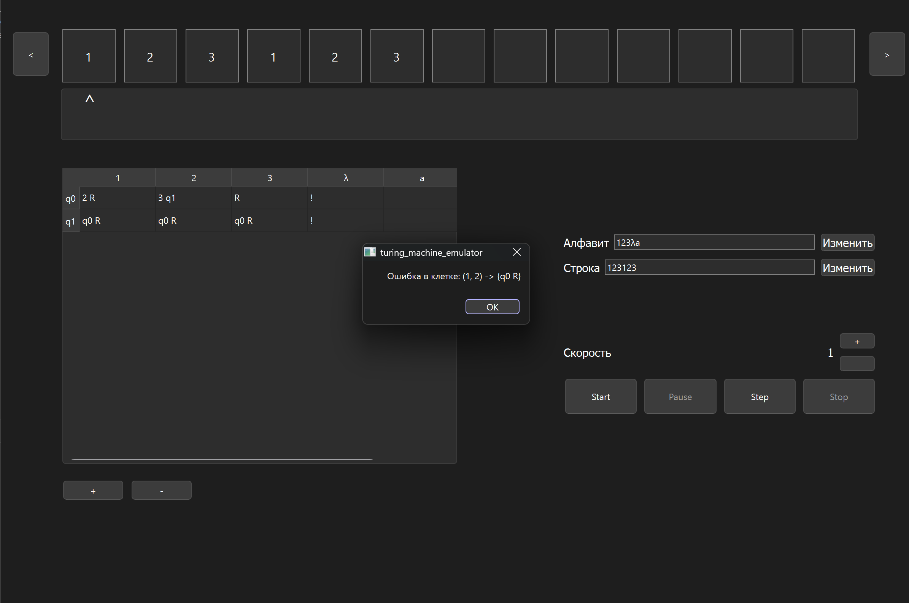
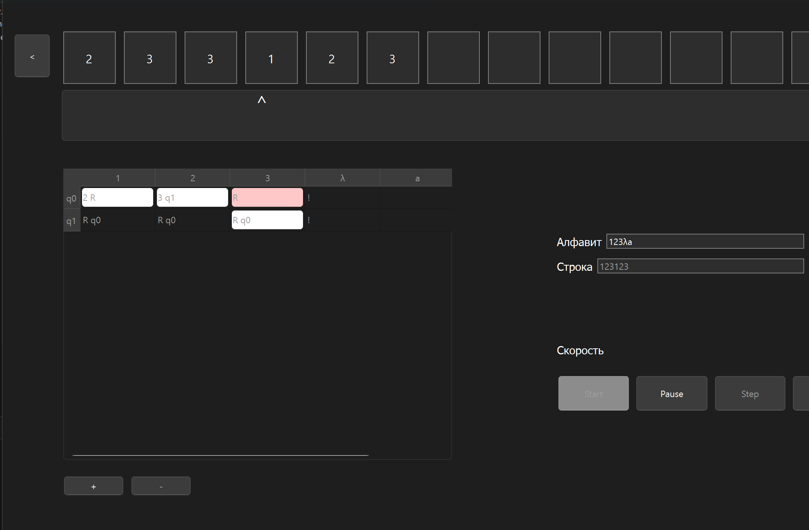

# Turing Machine Emulator (Qt C++)

This is a fully functional **Turing machine emulator** written in **C++ with Qt**, offering a visual and interactive environment to simulate the behavior of abstract Turing machines.

The emulator allows you to configure the **tape**, **alphabet**, and **transition table**, and then run or step through execution with smooth **animation of the tape head**.

  
   
  
   
  

---

## Features

- Visual simulation of a **Turing machine**
- Animated **tape head movement**
- Manual editing of:
  - Input tape (initial string)
  - Machine alphabet
  - State transition rules
- Step-by-step execution mode
- Automatic run mode with adjustable speed
- Bi-directional tape movement with dynamic resizing
- Clean Qt-based GUI

---

## Technologies Used

- **C++17**
- *Qt Framework**
- Custom state machine and tape engine
- Qt Designer for UI

---
